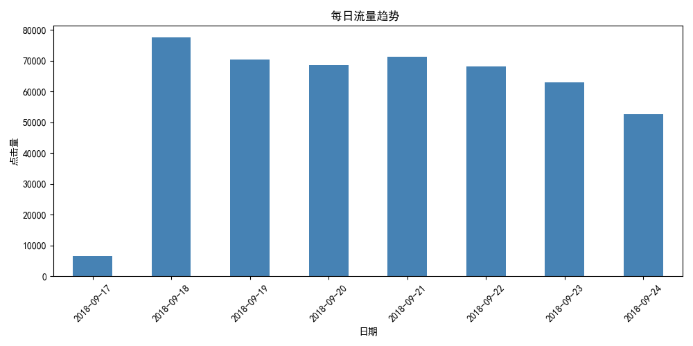

1. 流量趋势图
这是根据时间戳统计的每日样本量：

2. 智能分析摘要 (By Qwen)
# 数据分析报告

## 1. 数据分析摘要

本数据集共包含约 47.8 万条用户行为记录，其中正样本（“购买”）9,021 条，负样本（“未购买”）469,117 条，整体转化率为 **1.89%**，属于典型的高偏斜二分类问题。数据覆盖时间为 2018 年 9 月 17 日至 9 月 24 日，日均访问量在 6 万左右，首日（9月18日）流量显著高于其他日期，可能存在活动或推广引入的异常高峰。

核心特征如商品价格、销量水平和店铺评分分布较广，但多数集中在中高水平。用户性别、年龄、职业等画像字段存在明显集中趋势，部分类别占据绝对主导地位。商品类目与城市 ID 显示出高度集中的前缀结构（如 `7908382889764677758;` 开头），暗示可能存在层级编码或平台统一分类体系。

---

## 2. 数据质量风险点

### （1）缺失值问题：轻度存在，局部需关注
- 多个字段存在不同程度的缺失，其中 `user_gender_id` 缺失达 **12,902** 条（占比约 2.7%），是缺失最严重的字段。
- 用户属性字段（年龄、职业、星级）均缺失 964 条，可能为同一群体，需检查是否系统性缺失。
- 店铺评分相关字段（服务、物流、描述）仅缺失 59 条，`shop_review_positive_rate` 仅缺 7 条，整体完整度高，可处理。
- **结论**：缺失比例整体可控（<5%），但 `user_gender_id` 需重点对待，不宜直接删除。

### （2）长尾分布风险：显著存在于多个维度
- **标签分布极度不均衡**：转化率仅 1.89%，正负样本比接近 **52:1**，模型易偏向预测“未购买”，需进行采样或损失函数调整。
- **类别型变量高度集中**：
  - `user_gender_id=0` 占比超 75%，其余两类合计不足 25%；
  - `user_occupation_id=2005` 占比高达 62.7%，呈现严重长尾；
  - 商品类目和城市 ID 前五名合计占比较高，后续类别迅速衰减。
- **数值型特征也有偏移**：
  - `shop_review_positive_rate` 均值达 0.99，75% 分位已达 1.0，几乎全集中在高位，区分能力弱；
  - `item_sales_level` 最小值为 1，最大 17，均值 11.16，表明热销商品占主导。

### （3）类别爆炸与稀疏性隐患
- `item_category_list` 和 `item_city_id` 使用长整型字符串编码，且组合频繁出现相同前缀（如 `7908382889764677758;xxx`），暗示可能是多级类目拼接。
- 此类字段若不做拆解或嵌入处理，直接 one-hot 将导致**维度爆炸**，尤其当新类别持续出现时泛化困难。
- 类别总数未知，但从 Top5 已可见头部集中，大量低频类别可能形成“稀疏噪声”。

---

## 3. Baseline 建设建议

1. **处理样本不均衡问题**  
   在构建初始模型时，优先采用加权损失函数（如 `class_weight='balanced'`）或对少数类过采样（SMOTE）、多数类欠采样策略，避免模型陷入“全预测负类”的陷阱。评估指标应使用 AUC、F1-score 而非准确率。

2. **合理处理缺失值而非简单填充**  
   对 `user_gender_id` 等关键字段，建议将缺失作为一个独立类别（如 `-1` 或 “unknown”）保留，尤其警惕其是否蕴含行为模式差异（例如：不愿透露性别的用户转化意愿更低）。避免用均值/众数盲目填充造成信息扭曲。

3. **对高基数类别特征进行降维处理**  
   针对 `item_category_list`、`item_city_id` 等字段，建议先尝试提取一级类目（分号前部分）作为新特征，或使用目标编码（Target Encoding）、Embedding 等方式压缩维度，防止 one-hot 导致特征空间膨胀。

4. **探索时间趋势并划分训练/验证集**  
   数据具有明确的时间序列特性，应按时间顺序划分数据集（如前 6 天训练，最后 2 天验证），避免未来信息泄露。同时关注 9 月 18 日流量激增是否为促销事件，必要时加入“是否大促日”作为辅助特征。
